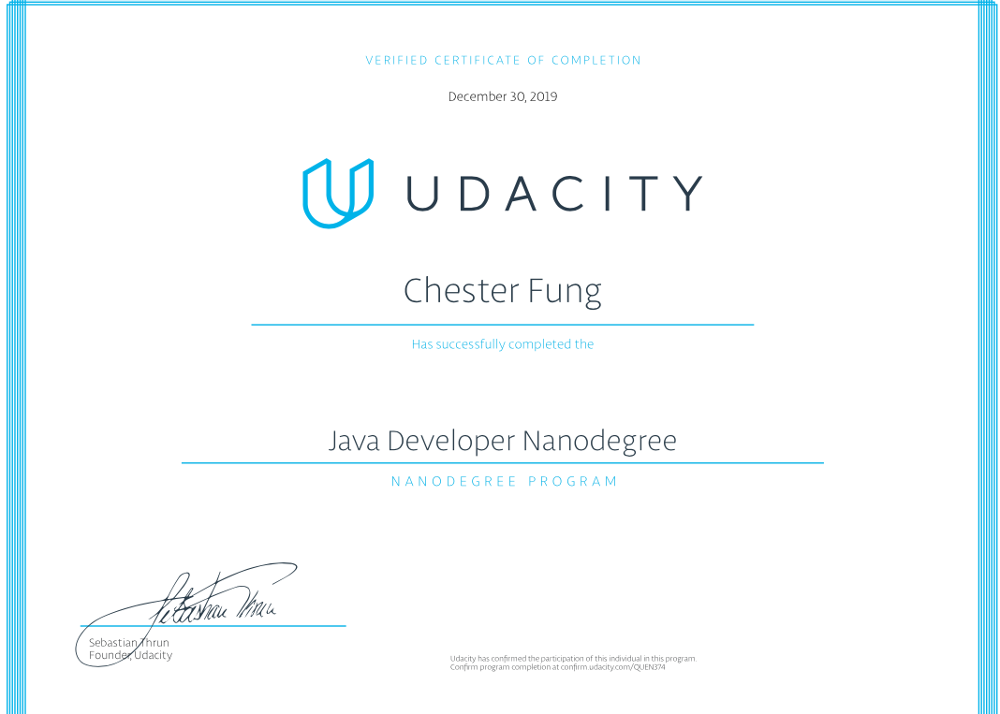

<h2>Projects</h2>
[Project 1](https://github.com/cfung/Java/tree/master/P01-Chatroom/starter_code) 
Create a chat room app using Spring Boot. Build a web-based chat room application using Spring Boot and WebSocket components.

[Project 2:()	
Develop the back-end system for a car website. Use Java APIs and frameworks to integrate different services using different communication styles.

[Project 3:]() 
Build a data store for customer reviews. Build the polyglot persistence layer for a REST API that will support the customer reviews section of a product page in an e-commerce application.

[Project 4:() 
Implement authorization for an e-commerce application. Use Jenkins to build a CI/CD pipeline to deploy code to production.

